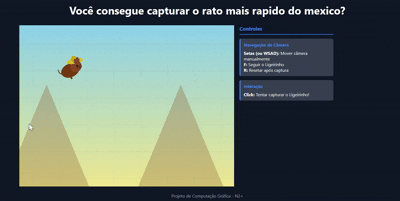

# A Corrida do Ligeirinho

Este é um projeto interativo desenvolvido para a disciplina de Computação Gráfica, apresentando:

- Movimento de câmera em um mundo 2D de grande escala  
- Personagem “Ligeirinho / Speedy Gonzales” com movimento autônomo  
- Sistema de **iluminação Phong** aplicado em elementos 2D  
- Background com **parallax**, montanhas e cactos  
- Renderização manual via **Canvas API**  
- Interação por clique: capture o Ligeirinho! 



---

## Resumo da Experiência

O usuário controla uma **câmera móvel** dentro de um mundo grande e colorido, onde o Ligeirinho corre aleatoriamente atrás de alvos invisíveis.  
Você pode:

- mover a câmera manualmente  
- mandar a câmera seguir o Ligeirinho  
- tentar clicar nele para capturá-lo  
- resetar o personagem após pegá-lo  

Ao capturar, um modal aparece com feedback visual.

---

## Tecnologias Utilizadas

- HTML5 Canvas 
- JavaScript ES Modules 
- Interpolação linear (lerp)  
- Modelo de Iluminação Phong  
- Transformações 2D e vetores 3D 
- Parallax no background

---

## **Principais Sistemas**

### 1. Iluminação Phong

Implementa:
- ambiente (`ambient`)  
- difusa (Lambertian)  
- especular (Blinn-Phong)  
- brilho (`shininess`)  

A cor final do Ligeirinho é calculada combinando essas componentes com sua cor base.

---

### 2. Câmera com interpolação suave

A câmera:
- segue uma posição alvo  
- move-se com suavidade usando lerp  
- respeita os limites do mundo  
- aceita comandos via **setas** e **WASD**  
- pode seguir o Ligeirinho com **F**

---

### 3. Ligeirinho

- Anda sozinho pelo mapa  
- Escolhe alvos aleatórios  
- Possui aceleração, velocidade máxima e bounce nas bordas  
- Tem animação (pernas, bounce, cauda)  
- Corpo renderizado com **iluminação Phong**  
- Pode ser clicado para captura  
- “Resetável” com **R**

---

### 4. SceneRenderer

Renderiza:
- céu com gradiente  
- grid de referência  
- montanhas com parallax  
- cactos espalhados pelo deserto  

Tudo convertido via **worldToScreen** da câmera.

---

### 5. VectorMath

Suporte matemático:
- normalização de vetores  
- produto escalar  
- soma de vetores  
- escala  

Compatível com vetores 2D/3D.

---

### 6. AffineTransform

Funções de matriz 3×3:
- `translate`  
- `rotate`  
- `scale`  
- `multiply`  
- `applyToPoint`  

Incluído para extensões e transformações mais complexas.

---

## Controles

### Movimento da câmera
| Tecla | Função |
|-------|--------|
| ⬆️⬇️⬅️➡️ | Move a câmera |
| W A S D | Move a câmera |

### Ações gerais
| Tecla/Mouse | Função |
|-------------|--------|
| **F** | Câmera segue o Ligeirinho |
| **Click** | Tenta capturar o Ligeirinho |
| **R** | Reseta o personagem após captura |
| Música | Toca automaticamente |

---

## Como Rodar

Use qualquer servidor local:

```bash
python -m http.server
```

---

## Licença

Projeto de uso livre para fins educacionais e acadêmicos.

---

## Autores
@aryMello
@drotgalvao
